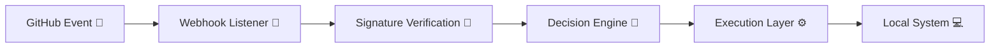
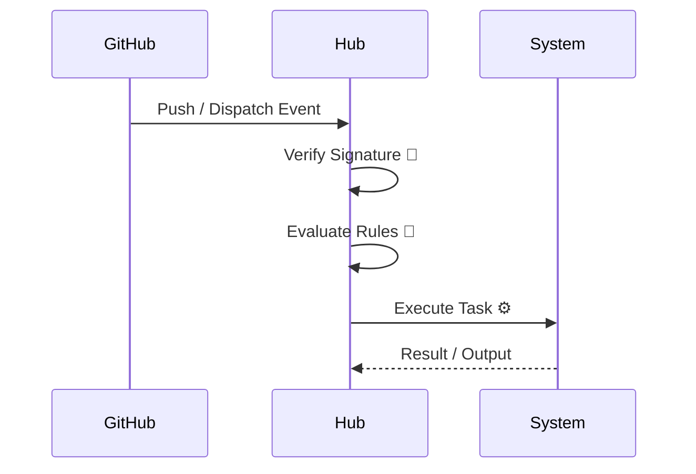

# ⚙️ System Automation Hub

### 🚀 Your Event-Driven Machine Control Plane

> **GitHub events aren’t notifications — they’re executable intent.**

---

## 🌌 Overview

**System Automation Hub** is a **local-first, event-driven control system** that transforms GitHub into a **secure command interface** for real machines.

It listens.
It verifies.
It decides.
It executes. ⚡

No fluff. No abstractions hiding reality. Just **deterministic automation wired directly to your system**.

---

## 🎯 Vision

> *Turn GitHub into a trusted, real-time control surface for local infrastructure.*

This project is designed as **living infrastructure**, not a demo:

* 🔐 Secure by design
* ⚙️ Explicit execution paths
* 🧠 Extensible control logic
* 🧩 Modular growth

---

## 🧬 Core Architecture

---

## 🧱 Core Principles

### 🟢 Local-First Execution

Automation runs where the hardware lives — no unnecessary cloud indirection.

### 🟡 Event-Driven Everything

Pushes, merges, labels, dispatches → **triggers**, not notifications.

### 🔴 Security is Non-Negotiable

* HMAC-SHA256 validation
* Explicit trust boundaries
* Zero blind execution

### 🔵 Modular & Explicit

* One responsibility per module
* Clear inputs/outputs
* No hidden magic

### 🟣 Future-Ready

Designed for:

* Containers 🐳
* GPUs ⚡
* Orchestration systems 🧩

---

## 🧠 Current Capabilities

| Status | Feature                        | Description                               |
| :----: | ------------------------------ | ----------------------------------------- |
|    ✅   | 🔐 Secure Webhook Listener     | Validates GitHub signatures (HMAC-SHA256) |
|    ✅   | ⚙️ PowerShell Execution Engine | Native Windows automation runtime         |
|    ✅   | 🌐 Local HTTP Endpoint         | Dedicated localhost control interface     |
|    ✅   | 🌍 Public Tunnel Support       | ngrok (Cloudflare / Tailscale planned)    |
|    ✅   | 🔁 Event → Action Pipeline     | Push / merge / dispatch triggers          |
|   🟡   | 🐳 Container Targets           | Docker / WSL execution expansion          |
|   🟡   | 📊 Workflow Orchestration      | Prefect / structured pipelines            |
|   🟡   | ⚡ GPU Task Queue               | ML / compute workload routing             |
|   🟡   | 🤖 Self-hosted Actions Runner  | Repo controlling itself                   |
|   🟡   | 🛡️ Policy Engine              | Rule-based execution control              |

---

## ⚡ Example Flow

---

## 🧪 Philosophy in Practice

This system treats:

* GitHub as **intent input**
* Your machine as **execution authority**
* The Hub as **trusted mediator**

---

## 🛠️ Tech Stack

* 🧠 PowerShell (execution core)
* 🌐 HTTP listener (local endpoint)
* 🔐 HMAC verification
* 🌍 ngrok (temporary exposure)
* 🐍 Python (auxiliary tooling / expansion)

---

## 🔮 Roadmap Highlights

* 🧩 Pluggable execution backends
* ⚖️ Policy-as-code (OPA-style)
* 🧠 Intelligent routing (CPU/GPU aware)
* 📡 Observability + logging pipeline
* 🏗️ Full self-hosted automation loop

---

## 👤 Maintainer

**Ruh-Al-Tarikh**
🧠 Personal systems automation
⚙️ Infrastructure experimentation
🔥 Occasional chaos engineering

---

## 💡 Final Thought

> This isn’t automation for convenience.
> This is **control, defined precisely and executed intentionally**.

---

✨ *Build systems that listen. Trust only what you verify. Execute with purpose.*
